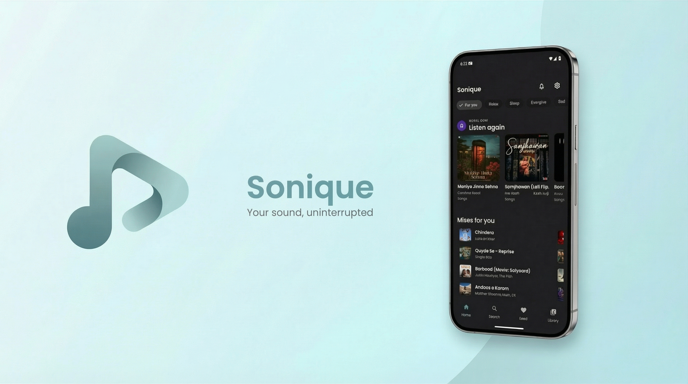

# Sonique

**Sonique** is a powerful, minimal, and ad-free YouTube Music client for Android, built with **Jetpack Compose** and **Kotlin Multiplatform**.

It is designed to provide a premium music streaming experience without interruptions, featuring a modern UI, privacy-focused features, and robust offline capabilities.

---

## ✨ Features

*   **🚫 Ad-Free Experience**: Enjoy music without any ads or interruptions.
*   **🎧 Background Playback**: Keep your music playing while using other apps or when the screen is off.
*   **📥 Offline Support**: Download songs and playlists for offline listening.
*   **📜 Synced Lyrics**: Real-time lyrics from multiple sources (YouTube, Spotify, LRCLIB).
*   **🎨 Dynamic Design**: Beautiful Material You interface that adapts to your music.
*   **📊 Music Analytics**: Track your listening habits and most played tracks.
*   **🚗 Android Auto**: Seamless integration for a safe driving experience.
*   **🎬 Video Mode**: Toggle between high-quality audio and 1080p music videos.
*   **🌚 Sleep Timer**: Fall asleep to your favorite tunes with a built-in timer.
*   **🔒 Privacy Focused**: Option to skip "Music Off-topic" segments and SponsorBlock integration.

Note: As this application relies on undocumented YouTube Music APIs, occasional playback errors may occur. This is an inherent limitation of the platform, and 100% stability cannot be guaranteed.

---

## 🛠️ Built With

Sonique is engineered using modern Android development practices and libraries:

*   **Language**: [Kotlin](https://kotlinlang.org/)
*   **UI Framework**: [Jetpack Compose](https://developer.android.com/jetpack/compose) & [Compose Multiplatform](https://www.jetbrains.com/lp/compose-multiplatform/)
*   **Architecture**: MVVM / MVI
*   **Networking**: [Ktor](https://ktor.io/)
*   **Dependency Injection**: [Koin](https://insert-koin.io/)
*   **Image Loading**: [Coil](https://coil-kt.github.io/coil/)
*   **Player**: [Media3 / ExoPlayer](https://developer.android.com/media/media3)

---

## � Data Sources

This application retrieves data from YouTube Music by leveraging undocumented APIs and technical workarounds. It also utilizes the Spotify Web API, along with additional techniques, to access Spotify Canvas animations and song lyrics.

The approach for extracting YouTube Music data is inspired by the [InnerTune](https://github.com/z-huang/InnerTune/) project.

Special thanks to [SmartTube](https://github.com/yuliskov/SmartTube), whose repository provided valuable insight into extracting streaming URLs from YouTube Music.

To enhance the viewing experience, the app integrates [SponsorBlock](https://sponsor.ajay.app/) to automatically skip sponsored segments in YouTube videos. It also uses **Return YouTube Dislike** to retrieve community-based vote information.

Lyrics data is provided by [LRCLIB](https://lrclib.net/).

---

## 🔒 Privacy

Sonique does not include any trackers or third-party services for collecting user data.

If a logged-in YouTube user enables the “Send back to Google” option, Sonique will use the official YouTube Music Tracking API solely to submit listening history and playback activity to Google. This is done to improve content recommendations and to support artists and YouTube creators.

---

## 📄 License

Distributed under the **GNU General Public License v3.0**. See `LICENSE` for more information.

---

## 👨‍💻 Developer/ Designer 

**Ansh Sharma**

## ☕ Support the Project   

If you enjoy using Sonique and want to support its development, you can buy me a coffee!   

[buymeacoffee.com/07Ansh](https://buymeacoffee.com/07Ansh)

---

*   Built with ❤️ in [Kotlin](https://kotlinlang.org/). Fueled by coffee ☕.