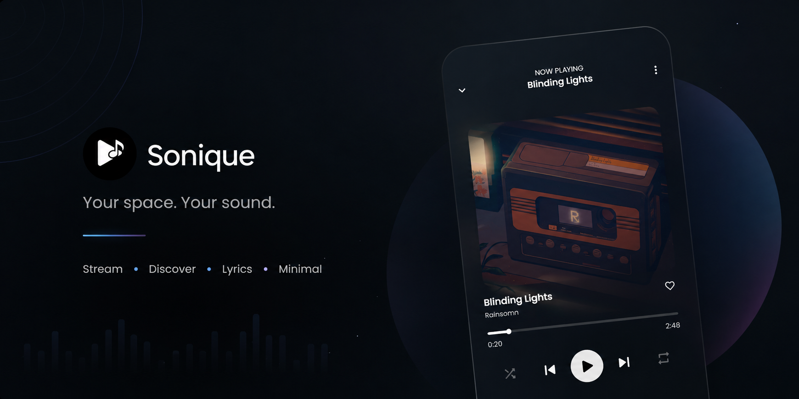
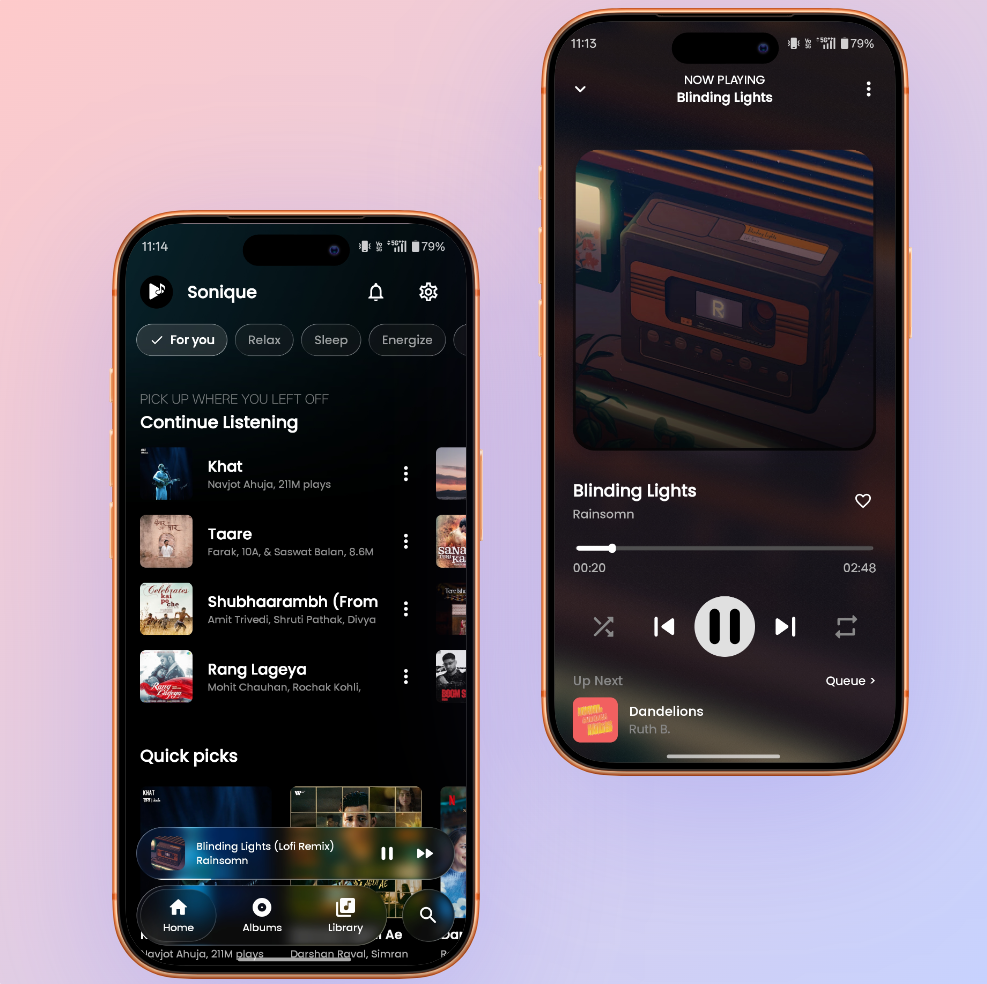
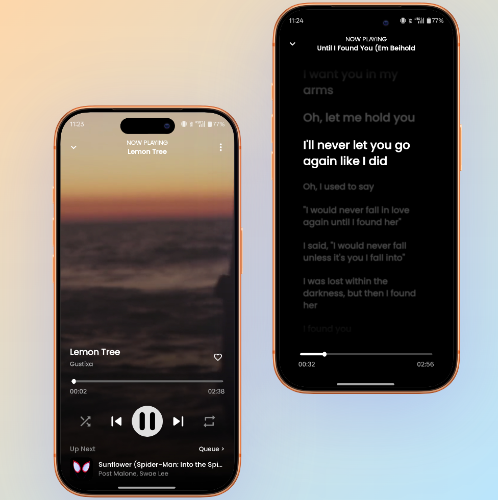
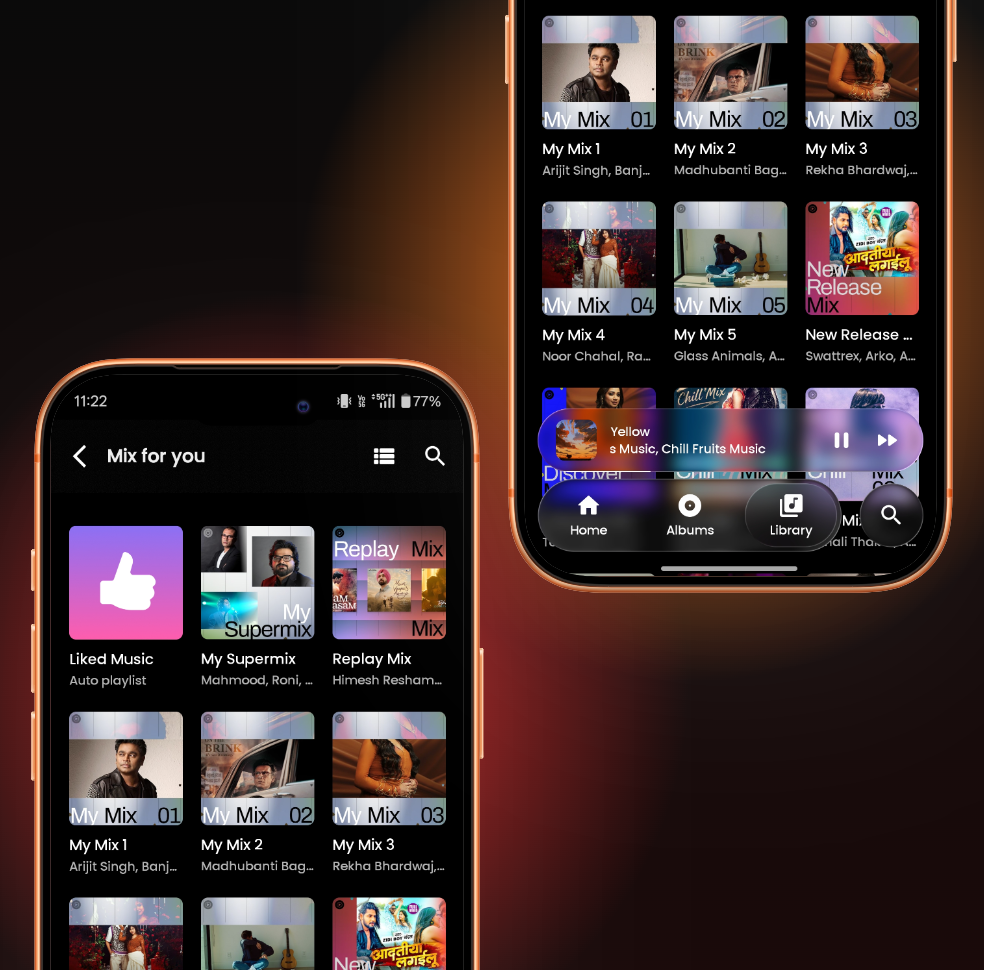
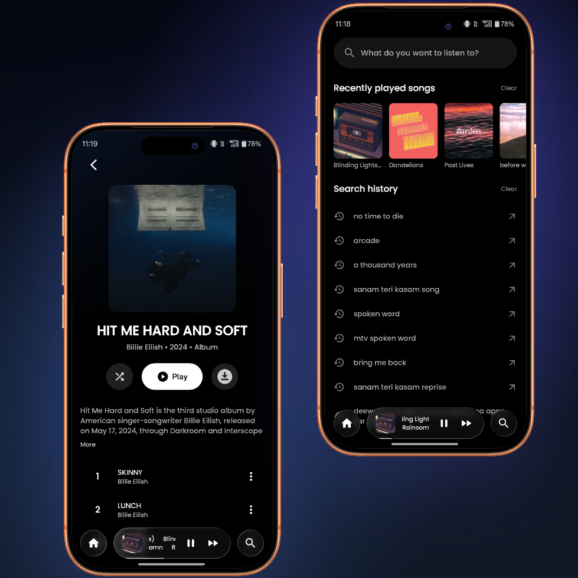
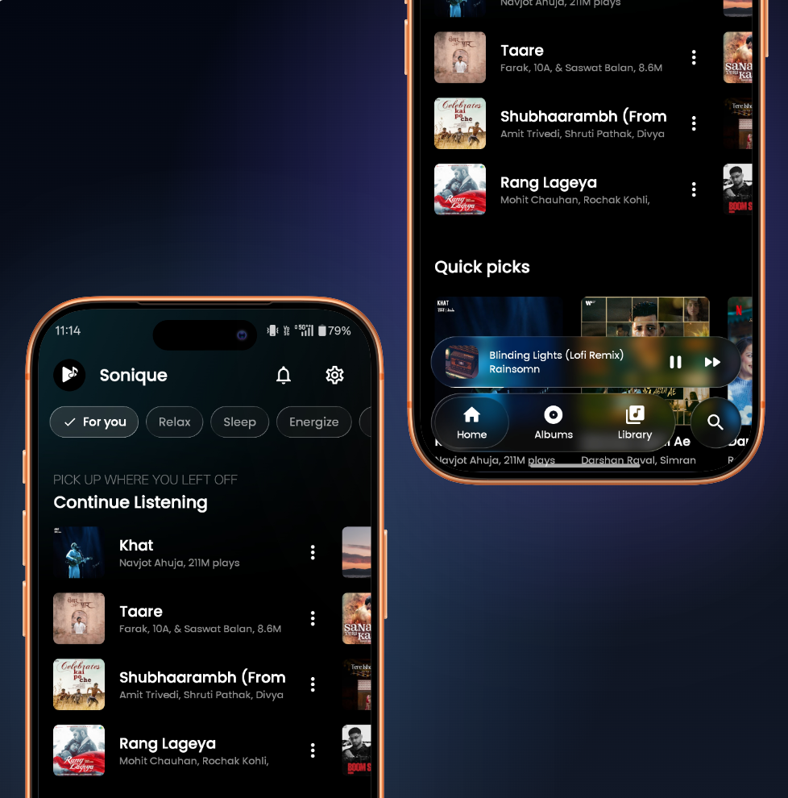
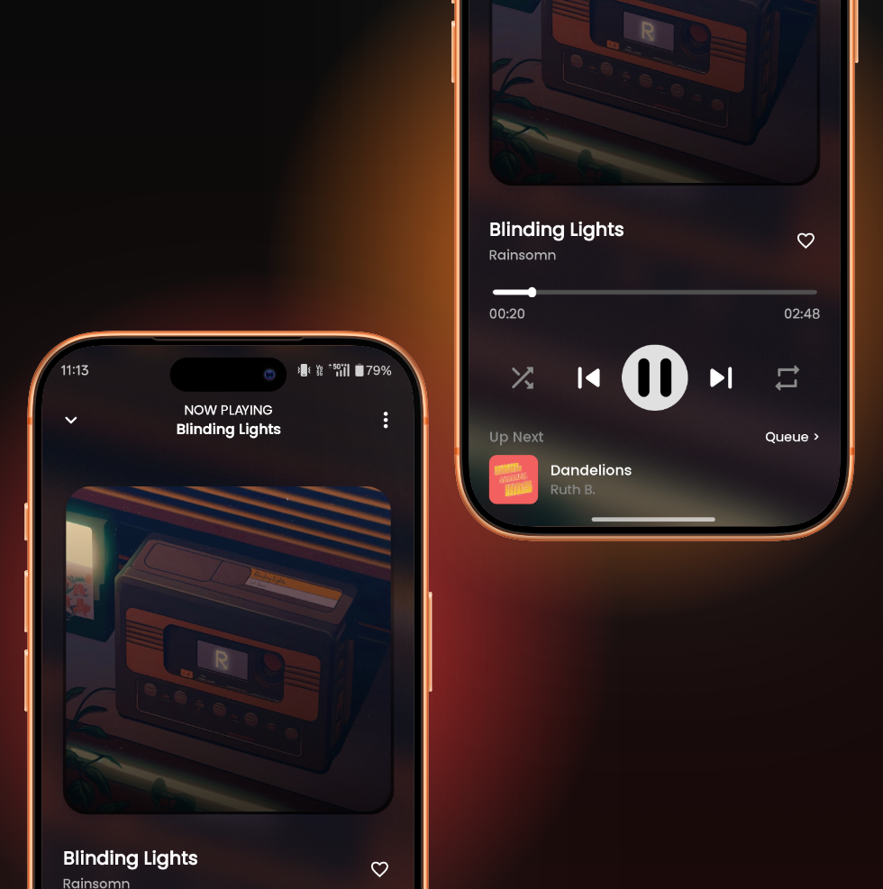
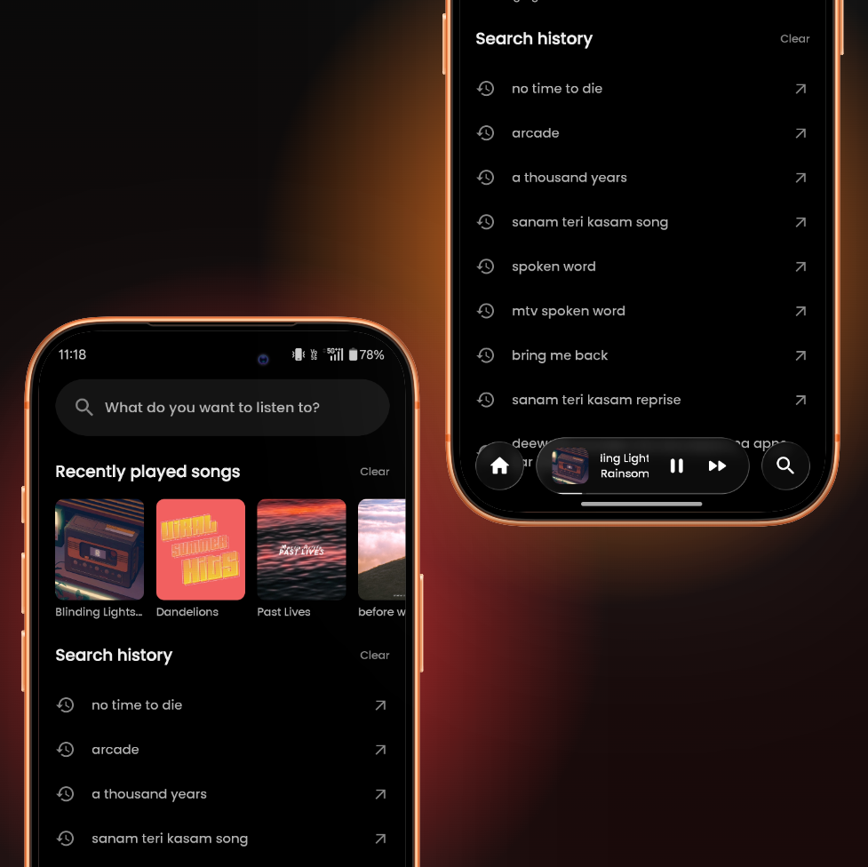
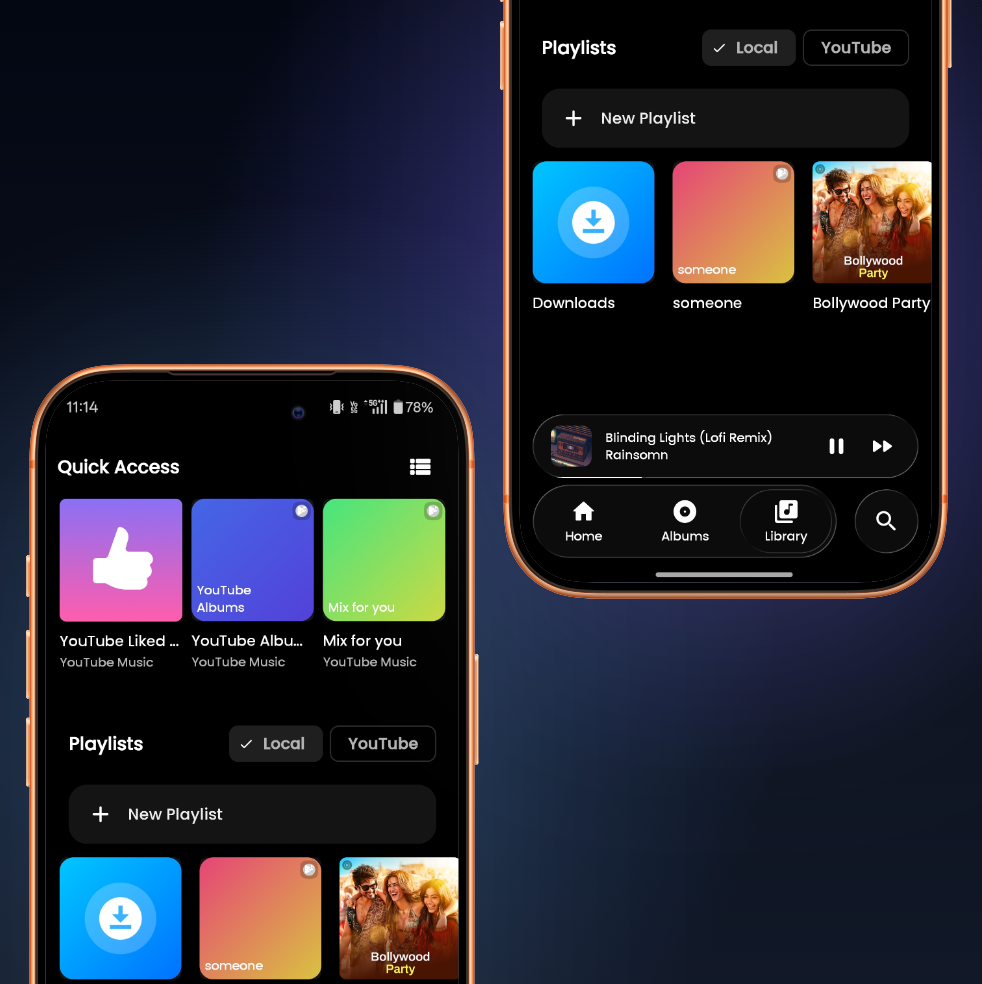

# Sonique



<div align="center">

**A powerful, minimal, and ad-free music streaming experience for Android**

[](https://github.com/07-Ansh/Sonique/releases/latest)
[](LICENSE)
[](https://kotlinlang.org/)
[](https://developer.android.com/jetpack/compose)

[Download](#-download) • [Screenshots](#-screenshots) • [Features](#-features) • [Tech Stack](#-tech-stack) • [Architecture](#-architecture) • [Legal](#%EF%B8%8F-legal-disclaimer--compliance) • [Support](#-support-the-project)

</div>

---

## 📥 Download

<div align="center">

<a href="https://github.com/07-Ansh/Sonique/releases/latest">
  
</a>
&nbsp;
<a href="https://apps.obtainium.imranr.dev/redirect.html?r=obtainium://add/https://github.com/07-Ansh/Sonique">
  
</a>

</div>

### **Requirements**
- **Android 8.0 (API 26)** or higher
- **~37MB** storage space
- **Universal APK** (compatible with ARM64, ARMv7, x86, and x86_64 devices)

### **Installation**
- **Option A (Direct APK)**: Download the latest release **`.apk`** from [GitHub Releases](https://github.com/07-Ansh/Sonique/releases/latest) and tap to install.
- **Option B (Auto-Updates via Obtainium)**: Open [Obtainium](https://github.com/ImranR98/Obtainium) on your phone and tap **Add to Obtainium** above for seamless automatic updates directly from GitHub.

---

## 📸 Screenshots

<div align="center">

| | |
| :---: | :---: |
|  |  |
| **Home & Now Playing** | **Now Playing Canvas & Synced Lyrics** |
|  |  |
| **Mix For You** | **Albums & Search View** |
|  |  |
| **Home Dashboard** | **Player Controls** |
|  |  |
| **Music Search** | **Music Library** |

</div>

---

## ✨ Features

### 🎵 **Core Music & Playback**
- **🚫 100% Ad-Free Streaming** — Enjoy completely uninterrupted music with zero ads or audio breaks
- **🔒 Built-in SponsorBlock** — Automatically skips non-music intros, promotional talk, and silent outros
- **🎧 Seamless Background Playback** — Keep listening while using other apps or with your screen turned off
- **🎚️ Smart Audio Crossfade** — Smoothly blend tracks together without abrupt silence between songs
- **🔊 Dynamic Volume Normalizer** — Automatically balances audio levels so quiet and loud songs match
- **📥 Offline Downloads** — Save your favorite songs, full albums, and playlists directly to your device

### 📜 **Synced Lyrics**
- **🎤 Real-Time Synced Lyrics** — Sing along with live, line-by-line synchronized lyrics powered by 7 engines (**LyricsPlus, LRCLIB, KuGou, BetterLyrics, Paxsenix, and YouTube**)
- **👆 Interactive Seeking** — Tap on any lyric line to jump playback directly to that exact moment

### 📂 **Library & Playlist Management**
- **➕ Local Playlist Creator** — Create custom offline playlists on your device anytime
- **✏️ Rename & Organize** — Easily rename, reorganize, or delete local playlists with a simple long-press
- **🔄 YouTube Music Sync** — Optional sign-in to sync your existing YouTube Music playlists, favorites, and mixes

### 🚗 **Connected & Smart Features**
- **🚗 Full Android Auto Support** — Access your recently played tracks, playlists, and downloads on your car's dashboard with steering wheel controls
- **🌚 Bedtime Sleep Timer** — Set an automatic timer to pause playback gently when you fall asleep
- **🔄 One-Tap In-App Updates** — Check for new releases, view changelogs, and update directly from within the app
- **🌐 Multi-Language Support** — Available in 25+ languages

### 🔐 **Privacy & Control**
- **🛡️ Zero Trackers** — No analytics or third-party tracking
- **💾 Local-First Storage** — All data stored locally on your device
- **🔄 Optional Google Sync** — Opt-in listening history sync with YouTube Music
- **🎯 Content Filtering** — Skip "Music Off-topic" segments

---

## 🛠️ Tech Stack

### **Core Technologies**

| Component | Technology | Version |
|---|---|---|
| 🎨 **UI Framework** | Jetpack Compose Multiplatform | 1.10.0 |
| 💜 **Language** | Kotlin | 2.2.21 |
| 🎭 **Material Design** | Material 3 & Expressive | 1.10.0 |
| 🏗️ **Architecture** | Clean Architecture (MVVM / MVI) | - |
| 💉 **Dependency Injection** | Koin | 4.1.1 |
| 🧭 **Navigation** | Navigation Compose | 2.9.1 |

### **Media & Networking**
- **🎵 Media Playback:** AndroidX Media3 / ExoPlayer 1.10.1
- **🌐 HTTP Client:** Ktor 3.3.3 & OkHttp 5.3.2
- **🖼️ Image Loading:** Coil 3.3.0
- **🎥 Media Extraction:** NewPipe Extractor & ytdlp-android 0.18.1
- **🔊 Audio Processing:** FFmpeg Kit Audio 6.0.1 & Custom Crossfade Adapter

---

## 🏗️ Architecture

Sonique follows **Clean Architecture** principles with a modular structure:

```
sonique/
├── composeApp/          # Android app UI, screens, navigation & ViewModels
├── core/
│   ├── common/          # Shared models, constants & cross-cutting utilities
│   ├── data/            # Room KMP database, DataStore & multi-source repositories
│   ├── domain/          # Business logic, entities & reactive use-cases
│   ├── media/           # Media3 ExoPlayer, Crossfade Adapter & Audio Session
│   └── service/         # YouTube scraper, 7-Tier Lyrics Engine & external APIs
└── MediaServiceCore/    # Low-level audio streaming modules & Android Auto services
```

---

## 🤝 Contributing

Contributions are welcome! Here is how you can help:

1. 🐛 **Report Bugs** — Open an issue with reproduction steps and device details
2. 💡 **Suggest Features** — Share your ideas in GitHub discussions
3. 🔧 **Submit PRs** — Fork the repo, create a feature branch, and open a Pull Request
4. 🌐 **Translations** — Help translate Sonique into more languages

---

## 📄 License

```
Copyright (C) 2025-2026 Ansh Sharma

This program is free software: you can redistribute it and/or modify
it under the terms of the GNU General Public License as published by
the Free Software Foundation, either version 3 of the License, or
(at your option) any later version.

This program is distributed in the hope that it will be useful,
but WITHOUT ANY WARRANTY; without even the implied warranty of
MERCHANTABILITY or FITNESS FOR A PARTICULAR PURPOSE. See the
GNU General Public License for more details.
```

See [LICENSE](LICENSE) file for full details.

---

## ⚠️ Legal Disclaimer & Compliance

> [!IMPORTANT]
> **Educational & Non-Commercial Notice**: Sonique is an open-source client application developed solely for personal, educational, and research purposes.

- **Non-Affiliation**: Sonique and its maintainers are **not** affiliated, associated, authorized, endorsed by, or in any way officially connected with YouTube, YouTube Music, Google LLC, Spotify, or any of their subsidiaries or affiliates.
- **No Media Hosting**: Sonique **does not host, store, archive, broadcast, or distribute** any audio streams, music videos, or copyrighted media content. All content displayed or played within the app is fetched dynamically from public web endpoints at the direction of the end user.
- **User Responsibility**: End users are solely responsible for ensuring that their use of this software complies with all applicable local, national, and international laws, regulations, copyright statutes, and third-party terms of service in their jurisdiction. The developers assume no legal liability for any misuse of this software or violation of applicable laws.
- **Trademarks & Fair Use**: All product names, logos, brands, trademarks, and registered trademarks referenced in this repository belong to their respective copyright holders. Usage in this repository is strictly for identification and descriptive purposes under fair use principles.
- **No Warranty**: As stated under the GNU General Public License v3.0, this program is distributed **"as-is" without warranty of any kind**, express or implied, including but not limited to merchantability, fitness for a particular purpose, or non-infringement.

---

## 🙏 Acknowledgments

- **[NewPipe](https://github.com/TeamNewPipe/NewPipeExtractor)** — YouTube data extraction
- **[SmartTube](https://github.com/yuliskov/SmartTube)** — Streaming URL extraction techniques
- **[InnerTune](https://github.com/z-huang/InnerTune/)** — Architecture and inspiration
- **[LRCLIB](https://lrclib.net/)** — Synced lyrics database
- **[SponsorBlock](https://sponsor.ajay.app/)** — Sponsored segment database

---

## 👨‍💻 Author & Developer

**Sonique** is designed, developed, and maintained with ❤️ by **[Ansh Sharma](https://github.com/07-Ansh)**.

<div align="center">

<a href="https://github.com/07-Ansh">
  
</a>
&nbsp;
<a href="https://github.com/07-Ansh">
  
</a>

</div>

---

## ☕ Support the Project

If you find Sonique useful and want to support its development:

<div align="center">

<a href="https://buymeacoffee.com/07Ansh">
  
</a>

<br><br>

<a href="https://buymeacoffee.com/07Ansh">
  
</a>

<br><br>

☕ **[buymeacoffee.com/07Ansh](https://buymeacoffee.com/07Ansh)**

<br>

Your support helps keep this project alive! ❤️

<br>

**Built with ❤️ using [Kotlin](https://kotlinlang.org/) • Fueled by coffee ☕**

⭐ **Star this repo if you like it!** ⭐

</div>

